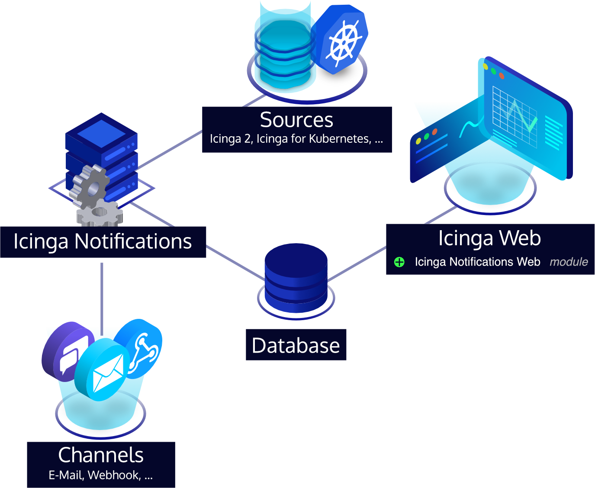

# Icinga Notifications

> [!WARNING]
> This is an early preview version for you to try, but do not use this in production.
> There may still be severe bugs and incompatible changes may happen without any notice.
> At the moment, we don't yet provide any support for this.

Icinga Notifications is a set of components that processes received events from various sources, manages incidents and
forwards notifications to predefined contacts, consisting of:

* The Icinga Notifications daemon (this repository), which receives events and sends notifications.
* The [Icinga Notifications Web](https://github.com/Icinga/icinga-notifications-web) module,
  which provides graphical configuration.
* Icinga 2 and other sources that provide monitoring events that result in notifications.

## Documentation

For more information about how to install or use Icinga Notifications,
just follow the [documentation](https://icinga.com/docs/icinga-notifications/latest).

## License

Icinga Notifications and the Icinga Notifications documentation are licensed under the terms of the
[GNU General Public License Version 2](LICENSE).
